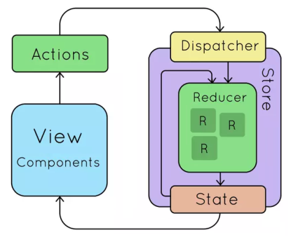
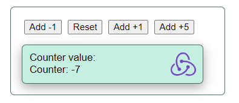

# Manager Redux

## The idea of Redux manager

Often, a user's action should reach multiple nested application components and trigger automatic responses in them. It is difficult to perform such tasks in simple ways.
Redux is a centralized state manager that mediates the transfer of actions and their results to target application components.

## Redux action:

- The user's action is issuing an (action)
- The (store) object provides a method (dispatch). Using (dispatch) the user initiates his (action) in the (store);
- Store takes the main property (state) from its memory, adds (action) from the dispatcher and passes them as arguments to the internal (reducer)
- Reducer is a method (store) that transforms the previous application state into a new one, based on the type of action;
- (Reducer), changing the state (state), launches a connected method (subscribe), which listens and which distributes changes (state) to (view) the user;

This way, automatic propagation of user actions to all attached modules is ensured.

## Application in action

This app is an example of Redux working with a basic html app (without React).
Buttons trigger 4 different actions that launch the Redux manager, as described above, and change the counter that is automatically displayed.

